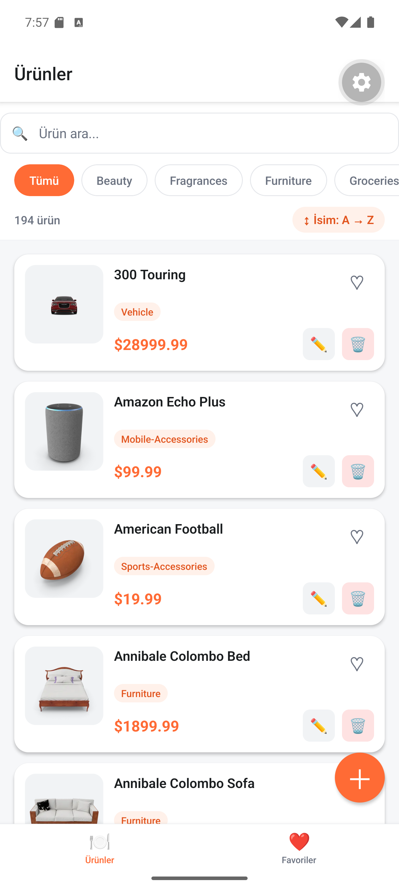

# Yapılanlar — Geliştirme Günlüğü ve Rapor

Bu belge, Moosoft mülakat case'i kapsamında projede yapılan tüm işleri, alınan
mimari kararları ve karşılaşılan/çözülen sorunları özetler.

> Uygulama tanıtımı, kurulum ve mimari detayları için ayrıca [`README.md`](./README.md) dosyasına bakın.

---

## 1. Genel Bakış

- **Ne yapıldı:** DummyJSON REST API tabanlı, restoran menü ürünlerini yöneten bir
  React Native (Expo) mobil uygulaması **sıfırdan** geliştirildi.
- **Stack:** Expo SDK 57 · TypeScript (strict) · Expo Router · TanStack Query ·
  Zustand (persist) · React Hook Form + Zod · AsyncStorage.
- **Durum:** Android emülatöründe çalışır halde doğrulandı (aşağıdaki ekran görüntüsü).



---

## 2. Uygulanan Özellikler (case gereksinimleriyle birebir)

| Gereksinim                     | Durum | Nerede                                                    |
| ------------------------------ | :---: | -------------------------------------------------------- |
| Ürün listeleme                 |  ✅   | `src/app/(tabs)/index.tsx`, `ProductCard`                |
| Ürün detayı                    |  ✅   | `src/app/product/[id].tsx`                               |
| Ürün ekleme                    |  ✅   | `src/app/product/add.tsx` + ortak `ProductForm`          |
| Ürün düzenleme                 |  ✅   | `src/app/product/edit/[id].tsx` + ortak `ProductForm`    |
| Ürün silme (onay diyaloğu ile) |  ✅   | `ConfirmDialog` + `useProductMutations`                  |
| Arama (debounce)               |  ✅   | `SearchBar` + `useDebounce` (400 ms)                     |
| Kategori filtreleme            |  ✅   | `CategoryFilter` + `useCategories`                       |
| Sıralama (4 seçenek)           |  ✅   | `SortSheet` + `lib/sort.ts` (client-side)                |
| Favoriler (kalıcı)             |  ✅   | `favorites.store.ts` + AsyncStorage persist              |
| Pull-to-Refresh                |  ✅   | `RefreshControl` → `refetch`                             |
| Form validasyonu               |  ✅   | `lib/validation.ts` (Zod)                                |
| Loading / Error / Empty        |  ✅   | `Skeleton`, `ErrorView`, `EmptyState`, toast             |

---

## 3. Kritik Mimari Kararlar

1. **Server state ↔ Client state ayrımı**
   - API verisi → TanStack Query cache.
   - Favoriler + lokal CRUD farkları → Zustand.

2. **Overlay katmanı (case'in asıl tuzağı):** DummyJSON CRUD isteklerini kalıcılaştırmaz.
   Bu yüzden create/update/delete sonuçları `localChanges` store'unda tutulup her render'da
   `mergeProductList()` ile API verisiyle birleştirilir. Böylece **pull-to-refresh** lokal
   değişiklikleri ezmez. (Detay: `README.md` ve `src/lib/merge.ts`.)

3. **Arama + kategori hibrit stratejisi:** DummyJSON bu ikisini tek istekte birleştirmediği
   için arama endpoint'i kullanılır, kategori ve isim filtresi birleşik sonuç üzerinde
   client-side uygulanır.

4. **Lokal ürünlere negatif ID** (`-Date.now()`) verilir → API ID'leriyle çakışmaz.

5. **Depolama = AsyncStorage** (plan MMKV öneriyordu). Gerekçe: MMKV Expo Go'da çalışmaz
   (development build ister). Depolama `src/lib/storage.ts` içinde soyutlandı; MMKV'ye geçiş
   tek dosyalık değişiklik.

---

## 4. Yapılan İşlerin Sırası

1. Expo SDK 57 + TypeScript projesi kuruldu, `src/` tabanlı klasör yapısı oluşturuldu.
2. Yapılandırma: `tsconfig` (strict + path alias `@/*`), ESLint (flat) + Prettier,
   `.env.example`, `.gitignore`, `.gitattributes`, `.npmrc`.
3. API katmanı: tek noktadan hata normalizasyonu + timeout içeren `fetch` client, tipler, uç noktalar.
4. Saf mantık (`lib/`): overlay merge, sıralama, Zod doğrulama, storage soyutlaması, query client.
5. State: Zustand store'ları (favoriler + local-changes overlay), toast.
6. Hook'lar: TanStack Query hook'ları, CRUD mutation'ları, debounce.
7. Yeniden kullanılabilir UI bileşenleri + ürün bileşenleri.
8. Expo Router ekranları ve navigasyon.
9. Doğrulama: `tsc --noEmit`, `eslint`, gerçek Metro **bundle** (1889 modül).
10. README + düzenli **conventional commit** geçmişi.
11. Android emülatöründe canlı doğrulama; bu sırada bulunan bir hata giderildi (bkz. §6).

---

## 5. Rapor: "unable to verify the first certificate" Hatası

### Belirti

Android emülatöründe `expo start` sonrası **"Fetching Expo Go"** adımında:

```
Error: unable to verify the first certificate
```

### Kök neden (teşhis edildi)

Makinede **Norton Antivirüs**'ün "Web/Mail Shield" bileşeni HTTPS trafiğini araya girerek
(SSL/TLS inspection) **kendi kök sertifikasıyla yeniden imzalıyor.** Sertifika zinciri
incelendiğinde ihraç eden (issuer) net görüldü:

```
Issuer: CN = "Norton Web/Mail Shield Root",
        OU = "generated by Norton Antivirus for SSL/TLS scanning"
```

Node.js kendi paketlediği (Mozilla) kök sertifika listesini kullanır ve bu listede Norton'un
kökü **yoktur**. Bu yüzden `expo`/`npm` gibi Node tabanlı araçlar Expo Go'yu indirmek için
HTTPS'e çıktığında sertifikayı doğrulayamaz:

```
node -e "https.get('https://api.expo.dev/v2/versions', ...)"
→ UNABLE_TO_VERIFY_LEAF_SIGNATURE
```

Norton'un kökü **Windows sertifika deposunda** kayıtlıdır (kurulumda eklenir).
Çözüm, Node'a bu işletim sistemi deposunu kullandırmaktır.

### Uygulanan çözüm (güvenliği KAPATMADAN)

Node 22'nin **`--use-system-ca`** seçeneği ile Node, Windows sertifika deposunu kullanır;
Norton kökü orada olduğu için doğrulama tam ve güvenli şekilde başarılı olur. Güvenlik
doğrulaması **devre dışı bırakılmadı** (ör. `NODE_TLS_REJECT_UNAUTHORIZED=0` veya
`strict-ssl=false` kullanılmadı).

Kalıcı hale getirmek için `package.json` script'leri güncellendi:

```jsonc
"start":   "cross-env NODE_OPTIONS=--use-system-ca expo start",
"android": "cross-env NODE_OPTIONS=--use-system-ca expo start --android",
"ios":     "cross-env NODE_OPTIONS=--use-system-ca expo start --ios",
```

Artık **`npm start`** yeterli; ek bir işlem gerekmez.

### Emülatörde çalıştırma adımları (yapılanlar)

1. Metro `NODE_OPTIONS=--use-system-ca` ile başlatıldı.
2. Doğru Expo Go sürümü SDK 57 için tespit edildi: **Expo Go 57.0.2**
   (Not: API'nin `latest` alanı eski `2.25.1`'i döndürüyordu; SDK 57 daha yeni bir istemci ister.)
3. Expo Go APK'sı Node + sistem CA ile güvenli indirilip `adb install` ile emülatöre kuruldu.
4. `adb reverse tcp:8081 tcp:8081` + `exp://127.0.0.1:8081` deep link ile uygulama açıldı.
5. Uygulama başarıyla derlendi ve 194 ürün DummyJSON'dan yüklendi.

### Değerlendiren kişi için not

Bu sorun **makineye özgüdür** (Norton SSL taraması). Norton olmayan bir makinede
`npm install && npm start` doğrudan çalışır. Script'lerdeki `--use-system-ca` zararsızdır ve
her ortamda güvenle kalabilir.

---

## 6. Canlı Testte Bulunan ve Giderilen Hata (bonus)

Emülatörde ilk açılışta kırmızı hata ekranı alındı:

```
The result of getSnapshot should be cached to avoid an infinite loop
→ Maximum update depth exceeded
Konum: src/hooks/useProducts.ts → useLocalChangesStore(selectLocalChanges)
```

**Sebep:** Zustand v5 tuzağı. `selectLocalChanges` seçicisi her render'da **yeni bir nesne**
(`{ added, updated, deleted }`) döndürüyordu; Zustand varsayılan olarak referans eşitliği
(`Object.is`) kullandığından her render yeni referans → sonsuz yeniden render döngüsü.

**Çözüm:** Seçici `useShallow` ile sarmalandı (`zustand/react/shallow`). Böylece nesnenin
alanları sığ (shallow) karşılaştırılır ve gereksiz render/döngü engellenir. Düzeltme
`useProducts.ts` ve `useProduct.ts` içinde uygulandı.

> Bu, gerçek cihazda test etmenin değerini gösteren, statik analizle yakalanamayacak bir
> çalışma zamanı hatasıydı.

---

## 7. Doğrulama Özeti

| Kontrol                 | Sonuç |
| ----------------------- | :---: |
| `npx tsc --noEmit`      |  ✅ 0 hata |
| `npx eslint .`          |  ✅ 0 hata |
| Metro production bundle |  ✅ 1889 modül |
| Android emülatör (canlı)|  ✅ Çalışıyor |
